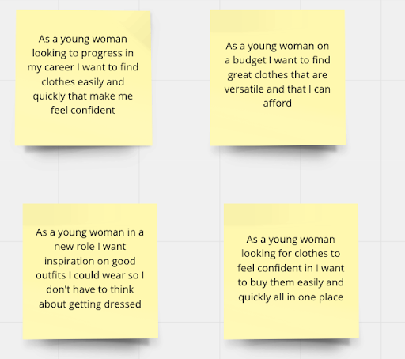
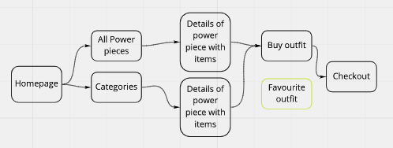
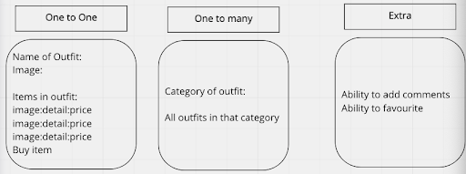
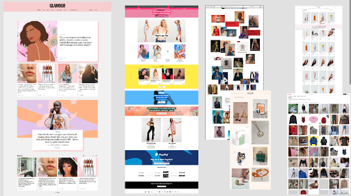
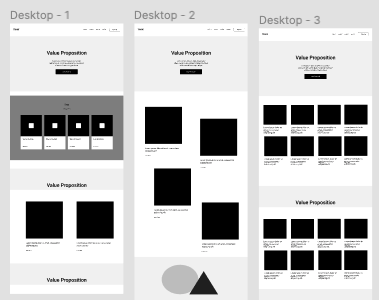
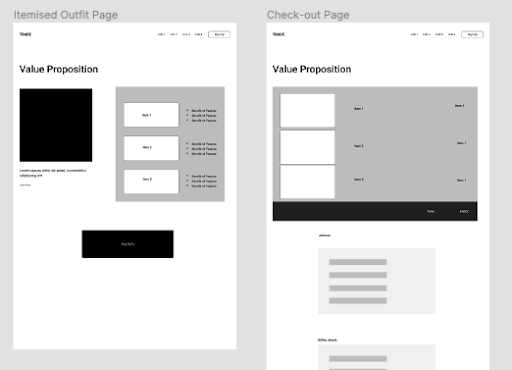

<h1>Power Dressing</h1>

<h2>Overview</h2> 

Power Dressing is an ecommerce mobile-friendly website designed to champion and support women who want to find clothes that allow them to feel comfortable, confident and strong in their environment. This site excites users with new looks from inspirational women, enables them to buy a similar statement piece, and allows them to place them in their basket and purchase multiple outfits. The style was themed on B&W with bright pictures and minimalist boxes and fonts. 

It is a full-stack application built with the Django REST Framework and React. It was a solo project built in 6 days. 

See website [here](https://power-dressing.herokuapp.com/) and GitHub repo [here](https://github.com/CNMABC/Project-4).

<h2>Brief</h2> 
<ul>
<li> Build a full-stack application by making your own back-end and front-end.</li>
<li>Use a Python Django API using Django REST Framework to serve your data from a Postgres database.</li>
<li>Consume your API with a separate front-end built with React.</li>
<li>Be a complete product which most likely means multiple relationships and CRUD functionality for at least a couple of models.</li>
<li>Implement thoughtful user stories/wireframes that are significant enough to help you know which features are core MVP and which you can cut.</li>
<li>Have a visually impressive design.</li>
<li>Be deployed online so it's publicly accessible.</li>
<li>Write your code DRY and build your APIs RESTful.</li>
<li>Timeframe: 8 days</li>
</ul>


<h2>Technologies Used </h2>
<ul>
<li>Django</li>
<li>Django REST Framework</li>
<li>PostgreSQL (TablePlus & Insomnia)</li>
<li>PyJWT</li>
<li>JavaScript (ES6)</li>
<li>React.js</li>
<li>HTML, CSS, Sass</li>
<li>React Bootstrap</li>
<li>Axios</li>
<li>Git + GitHub</li>
<li>react-notify-toast</li>
<li>react-router-dom</li>
<li>React-select</li>
<li>Asana</li>
<li>Figma</li>
</ul>


<h2>Approach & Planning</h2>

I began the design process of this website with the creation of user need statements to ensure I was user-led throughout the process. The process I went through was to empathise, define, ideate, prototype and test. 



I then created a user journey flow ensuring there were no additional pages the user had to go through which would encourage drop-off : 



The models of the relationships were then created. The empathise and definition stages were then completed as the user need statements and user flow map were done. 



To support the ideation stage I researched similar brands to see what was working well and what opportunities were available for improvements. This supported both the design, user flow and functionality planning. 



I then created several options in low fidelity wireframes to explore the next direction to go in as well as a few for different steps in the user flow. 





Once these were completed I started the process of building my models, views and serialisers in Django REST framework to create a SQL database . I used Table PLus to visualise the postgreSQL database and Insomnia to test the back-end requests ensuring all relationships between models responded and all JSON responses were being received as expected. 

I then started on my front-end using React Bootstrap to create my different components including home, outfits and basket. I did overestimate my time so I was unable to include my comments model on the front-end or the outfit category filter. 

<h2>Wins</h2> 

<ul>
<li>I absolutely loved setting up my Django back-end, everything went really smoothly and I completed it a lot faster than expected. </li>
<li>I was really happy with the typewriting effect on the homepage. I felt it made a big impression but was really easy to implement.</li>
<li>After 4 projects I had become a lot faster at sorting out bugs and I had a much more positive can-do attitude which previously had got disheartened quite easily.</li>
<li>The whole website is mobile-responsive which was really important for me. </li>
</ul>

``` javascript
 
<Typewriter
                 options={{
                   className: 'hero-title', strings: ['You are powerful', 'Wear confidence', 'You are beautiful', 'Be who you want', 'You are strong', 'Dream big', 'You are not an imposter', 'You are brave'],
                   autoStart: true,
                   loop: true,
                 }}
 
```

<h2>Challenges</h2>

<ul>
<li>Using local storage to complete the basket took much longer than anticipated, multiple parts needed to be kept together so that the total of each item was added but also that the items stayed in local storage and didn’t disappear when the page reloaded. </li>
<li>Although my design was minimalist I found the cards needed more depth to them but I was really happy to find items of clothing that were uniformed so they looked similar and the pictures of women were bold with colour. </li>
</ul>

``` javascript
const Basket = () => {
 const [basketItems, setBasketItems] = useState(null)
 const [total, setTotal] = useState(0)
 
 // const { id } = useParams()
 
 useEffect(() => {
   const getBasketFromLocalStorage = () => {
     const items = JSON.parse(localStorage.getItem('outfits'))
     const updatedWithQuantity = items.map(outfit => {
       return { ...outfit, quantity: 1 }
     })
     setBasketItems(updatedWithQuantity)
   }
   getBasketFromLocalStorage()
 }, [])
 
 
 const updateQuantities = (itemId, operator) => {
   const updatedOutfits = basketItems.map(item => {
     if (item.id === itemId) {
       if (item.quantity === 0 && operator === '-') return item
       return { ...item, quantity: operator === '+' ? item.quantity + 1 : item.quantity - 1 }
     }
     return item
   })
   setBasketItems(updatedOutfits)
 }
 // total up the cost based on the quantity, this runs everytime basketitems is updated
 useEffect(() => {
   const totalPrice = basketItems && basketItems.reduce((acc, item) => {
     return acc + (item.price_1 * item.quantity)
   }, 0)
   setTotal(totalPrice)
 }, [basketItems])

```

<h2>Bugs</h2>

<ul>
<li>In the basket the same item can be added twice but this appears as an additional item rather than the quantity added increasing by +1 .</li>
</ul>

<h2>Future Improvements </h2>

<ul>
<li>To increase the amount of items in the database so the website has more options and clothes available.</li>
<li>Sort out all of the bugs.</li>
<li>Utilise the comment and categories in the front-end which had been created in the back-end. </li>
<li>Improve the design of the cards, allow for shadowing and other UI features. </li>
<li>Once a basket has been purchased and the user's order confirmed I would like to create a  ternary to confirm this to the user by personalising the message with their name. </li>
</ul>

<h2>Key Learnings</h2>

I appreciate baskets so much more when I am on websites! The basket and local storage took up a lot of my time and I found it difficult to ensure it had no bugs. My mindset and approach was completely different for my last project, I was at ease with bugs and happy and calm throughout. Working by myself increased my confidence as there was nowhere to hide and I enjoyed all the problem solving and really thrived doing the full-stack from the design to the database. 


